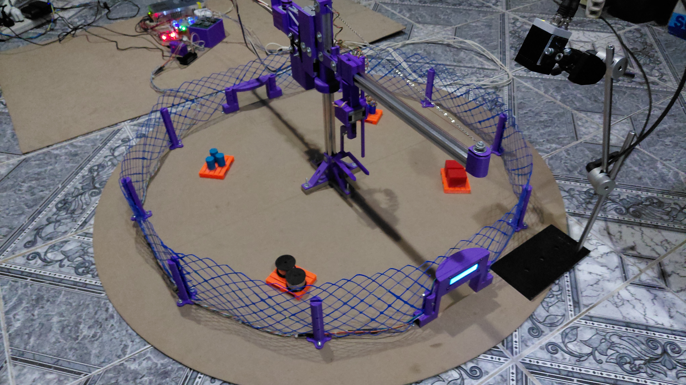

# Brief del proyecto

## Almacenamiento y despacho automatizado con grúa torre

**Valentín Coluccio y Franco Gómez**
Ingeniería en Mecatrónica — Universidad Nacional de Lomas de Zamora — 2026

<!-- FOTO 1 → Media/01-vista-general.jpg — la maqueta completa terminada, vista general, bien iluminada. Es la primera imagen que va a ver alguien que entra al repositorio. -->

---

## De qué se trata

Construimos una maqueta funcional de un depósito automático. Es un depósito sin personas adentro: las cosas entran, el sistema de manera automática las reconoce, las guarda en el lugar que les corresponde, y cuando alguien las necesita, las va a buscar y las trae.

Lo particular es cómo se piden las cosas: **hablándole**. El operador dice en voz alta qué necesita y el sistema se lo alcanza.

La máquina que hace el trabajo físico es una **grúa torre**, la misma que se ve en cualquier obra en construcción, pero acá reducida al tamaño de una maqueta y controlada por una computadora en lugar de por un operario.

---

## Para qué sirve

Guardar cosas parece simple, pero en la industria es un problema caro. Un depósito necesita espacio, techo, estanterías, personal que sepa dónde está cada cosa y que se equivoque lo menos posible. Cuando el depósito crece, encontrar una pieza puede llevar más tiempo que usarla.

La automatización resuelve eso: el sistema nunca se olvida dónde guardó algo, no se confunde una pieza con otra y no necesita que alguien camine hasta el fondo del galpón.

Ahora bien, **este proyecto no busca reemplazar a los depósitos automáticos que ya existen** dentro de un galpón, donde hay soluciones muy buenas y muy probadas. La grúa torre tiene sentido en otro escenario:

- **A la intemperie**, donde construir un techo sobre toda la superficie sería carísimo.
- **En superficies grandes**, donde el alcance de una grúa cubre mucho más terreno que una estantería.
- **Con poca rotación**, es decir, cuando las cosas se guardan por bastante tiempo y no entran y salen todo el día.

Piezas grandes acopiadas al aire libre, materiales de obra, bobinas, contenedores: ahí es donde una grúa torre puede hacer un trabajo que otras máquinas no hacen bien.

---

## Cómo funciona, paso a paso

**1. Llega la pieza.**
Alguien apoya una pieza en la zona de entrada. Un sensor detecta que hay algo ahí.

**2. El sistema la reconoce.**
Una cámara inteligente mira la pieza y decide qué es. No lee un código ni una etiqueta: la reconoce por su forma y su aspecto, igual que lo haría una persona. Puede distinguir entre tipos de piezas distintas, en nuestro caso 4.

**3. La grúa la guarda.**
Sabiendo qué pieza es, el sistema decide en qué lugar del depósito va y le da la orden a la grúa. La grúa gira, se desplaza, baja, la levanta y la deposita en su casillero. Mientras tanto, anota internamente qué hay guardado y dónde.

**4. Alguien la pide, en voz alta.**
Cuando se necesita una pieza, el operador dice "torre" para llamar al sistema y le pide lo que necesita. No hay que tocar una pantalla ni escribir nada: se puede pedir con las manos ocupadas o con guantes puestos.

**5. La grúa la trae.**
El sistema verifica que esa pieza esté efectivamente guardada, va a buscarla y la deja en la zona de salida.

<!-- VIDEO: el ciclo completo, de punta a punta, sin cortes. Es lo que mejor explica el proyecto. Subir el archivo .mp4 arrastrándolo a un issue o comentario de GitHub y pegar acá el enlace que genera, o dejar el enlace a YouTube. -->
🎥 **[Ver el sistema funcionando](https://www.youtube.com/playlist?list=PLAaialL0bhKQ)**

---

## Qué hace falta para que esto funcione

Aunque desde afuera se ve simple, adentro hay tres cosas distintas trabajando en simultáneo y coordinadas entre sí:

- **Ver:** identificar correctamente qué pieza llegó.
- **Escuchar:** entender lo que dice una persona hablando normalmente, incluso con ruido alrededor.
- **Moverse:** llevar la grúa a un punto exacto del espacio, y volver a ese mismo punto todas las veces que haga falta.

Cada una de esas tres partes es un desafío por separado. El trabajo real del proyecto fue lograr que las tres funcionen juntas, al mismo tiempo, sin pisarse y sin equivocarse.

<!-- FOTO 3 → Media/03-detalle-operacion.jpg — un plano cerrado de la grúa levantando o depositando una pieza. Que se vea el detalle mecánico. -->

---

## Qué se logró

El sistema está construido y funcionando. Reconoce las piezas, entiende las órdenes habladas, guarda, recuerda dónde guardó y despacha lo que se le pide.

Todo el prototipo se construyó con un presupuesto de alrededor de 390.000 pesos argentinos (257 USD) —sin contar la cámara, que fue prestada—, con piezas impresas en 3D y componentes que se consiguen en el mercado local.

---

## Agradecimientos

A **eMove Solutions**, por el préstamo de la cámara industrial.
A **IDEA3D Impresiones**, por las primeras piezas impresas en 3D.

---

📄 La documentación técnica completa está en el [README](../README.md) de este repositorio.
