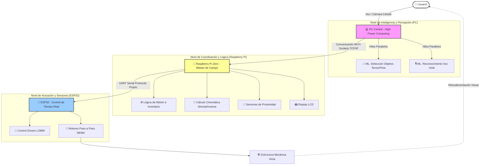

<div align="center">


<h2 align="center">Facultad de Ingeniería – Universidad Nacional de Lomas de Zamora</h2>

# 🏗️ Grúa Torre Robótica Inteligente

### Proyecto Final de Carrera | Ingeniería en Mecatrónica


</div>

---

## 📑 Índice

- [🧠 Descripción General](#-descripción-general)
- [📸 Galería y Demostraciones](#-galería-y-demostraciones)
- [🚀 Arquitectura del Sistema](#-arquitectura-del-sistema)
- [🔌 Protocolos de Comunicación](#-protocolos-de-comunicación)
- [📐 Cinemática y Control Embebido](#-cinemática-y-control-embebido)
- [⚙️ Funcionalidades Clave](#️-funcionalidades-clave)
- [🛠️ Tecnologías Utilizadas](#️-tecnologías-utilizadas)
- [📂 Estructura del Repositorio](#-estructura-del-repositorio)
- [👤 Autores](#-autores)

---

## 🧠 Descripción General

Este repositorio contiene el desarrollo integral (software, hardware, planos y documentación) de una **grúa torre robótica a escala**, presentada como Proyecto Final de Carrera para la carrera de **Ingeniería en Mecatrónica** en la Universidad Nacional de Lomas de Zamora (UNLZ).

El sistema simula un entorno logístico automatizado de alta complejidad. Integra hardware embebido, modelado cinemático tridimensional e Inteligencia Artificial distribuida para lograr un ciclo autónomo de:

1. **Percepción:** Detección y clasificación de objetos en tiempo real mediante visión artificial.
2. **Decisión:** Procesamiento de lenguaje natural (comandos de voz) y gestión lógica de inventario.
3. **Actuación:** Movimiento coordinado de precisión para la manipulación, almacenamiento y entrega de cargas.

> **Evolución Tecnológica:** La arquitectura de control de bajo nivel fue optimizada utilizando un microcontrolador **ESP32** bajo un paradigma de programación estructurada y modular. Esto garantiza una ejecución determinista de tiempo real para el manejo simultáneo de 4 actuadores paso a paso con velocidades independientes.

---

## 📸 Galería y Demostraciones

El proyecto cuenta con un diseño de ingeniería respaldado por modelos CAD y esquemas electrónicos, disponibles en este repositorio.

<div align="center">
  
  <br>
  <em>Render del ensamblaje mecánico completo de la grúa torre.</em>
</div>

<br>

<div align="center">
  
  <br>
  <em>Esquemático del circuito de potencia y control (Integración de ESP32, Drivers L298N y Raspberry Pi).</em>
</div>

<br>

### ⚙️ Modos de Operación Activos

**1. Almacenamiento Automatizado (Visión Artificial)** El sistema detecta e identifica los objetos en el espacio de trabajo para calcular sus coordenadas y almacenarlos de forma autónoma.

<div align="center">
  
</div>

<br>

**2. Despacho (Reconocimiento de Voz)** Mediante comandos de voz en lenguaje natural, la grúa busca el material solicitado en el inventario y lo despacha dinámicamente hacia la zona de descarga.

<div align="center">
  
</div>

<br>

> **🎬 Video Completo:** La simulación íntegra y en alta resolución de todo el proceso logístico está disponible en el repositorio. [Haz clic aquí para ver o descargar Animacion_Completa.mp4](Media/Animacion_Completa.mp4).

---

## 🚀 Arquitectura del Sistema

El proyecto implementa un modelo de computación distribuida y *Edge Computing*, segmentando las tareas críticas según la capacidad de cómputo:



### Flujo de Trabajo Operativo

1. **Visión e Inteligencia Artificial (PC):** Procesa flujos de video y audio en hilos paralelos (*multi-threading*). Traduce las intenciones del usuario y envía comandos lógicos a la estación de campo.
2. **Coordinación de Campo (Raspberry Pi):** Gestiona el inventario, interactúa con sensores y traduce las coordenadas espaciales cartesianas a coordenadas angulares y lineales.
3. **Actuación Dedicada (ESP32):** Recibe de forma secuencial las coordenadas parametrizadas y genera los trenes de pulsos precisos para los drivers de potencia de los motores A, B, C y D.

---

## 🔌 Protocolos de Comunicación

La robustez del sistema se fundamenta en un esquema híbrido de dos niveles:

* **Sockets TCP/IP (PC ↔ Raspberry Pi):** Comunicación inalámbrica asíncrona mediante sockets TCP sobre una red Wi-Fi local para la transferencia segura de comandos de estado.
* **Protocolo Serial UART Custom (Raspberry Pi ↔ ESP32):** Conexión física mediante pines RX/TX. Se diseñó un protocolo de tramas para empaquetar coordenadas de grados y enviarlas secuencialmente, asegurando una recepción determinista y libre de ruidos.

---

## 📐 Cinemática y Control Embebido

### Modelado Matemático
* **Parámetros Denavit-Hartenberg (DH):** Definición de los sistemas de coordenadas locales por eslabón (base rotativa, carro de traslación y gancho de elevación).
* **Matrices de Transformación Homogénea:** Operaciones algebraicas matriciales en la Raspberry Pi para calcular unívoca la cinemática inversa, obteniendo los pasos requeridos para cada motor a partir de un punto (X, Y, Z).

### Firmware Embebido Modular
El código en C++ para el **ESP32** adopta una arquitectura limpia y desacoplada:
* **Módulo Principal (`Main.ino`):** Orquesta el ciclo de vida y la escucha del puerto serial.
* **Módulo de Configuración (`Config.cpp / .h`):** Centraliza pines, mapeo de GPIOs y constantes.
* **Módulo de Motores (`Motor.cpp / .h`):** Implementa lógica orientada a objetos para controlar hasta 4 motores paso a paso de forma simultánea, gestionando perfiles de velocidad independientes.

---

## ⚙️ Funcionalidades Clave

* **Procesamiento Concurrente:** Uso estricto de hilos en Python, evitando que los algoritmos de TensorFlow Lite bloqueen la captura de audio.
* **NLP (Natural Language Processing):** Interpretación local de comandos verbales en español utilizando Vosk.
* **Manipulación de Precisión:** Control milimétrico del posicionamiento espacial acoplando la cinemática a la resolución mecánica de los motores.

---

## 🛠️ Tecnologías Utilizadas

| Capa del Proyecto | Tecnologías y Herramientas |
| :--- | :--- |
| **Visión Artificial** | Python 3.9+, OpenCV, TensorFlow Lite, Multithreading. |
| **Procesamiento de Voz** | API Vosk (Modelo en Español), Speech Recognition. |
| **Procesamiento de Campo** | Raspberry Pi OS, Sockets TCP/IP, Álgebra Matricial. |
| **Control en Tiempo Real** | C++, Framework Arduino / ESP-IDF, Arquitectura Modular. |
| **Hardware y Potencia** | Microcontrolador ESP32, Drivers L298N, Motores NEMA. |
| **Diseño e Ingeniería** | SolidWorks, Esquemas Eléctricos, Parámetros DH. |

---

## 📂 Estructura del Repositorio

La disposición de los directorios refleja fielmente la organización multidisciplinaria del proyecto (Mecánica, Electrónica y Software):

```bash
.
├── 📂 Datasheets/     # Hojas de datos técnicas de componentes (ESP32, NEMA, L298N, sensores).
├── 📂 Diseños/        # Archivos CAD originales, piezas 3D y elementos para manufactura.
├── 📂 Doc/            # Documentación de Ingeniería: cálculos, memoria técnica y tesis del PFC.
├── 📂 Media/          # Recursos multimedia y assets visuales utilizados en la documentación:
├── 📂 Planos/         # Planos constructivos mecánicos con vistas normalizadas y diagramas eléctricos.
├── 📂 Scripts/        # Scripts de software secundarios para pruebas de UART, red y calibración de motores.
└── 📄 README.md       # Documento principal de presentación del repositorio.
```

---

## 👤 Autores

Proyecto de fin de carrera desarrollado por los estudiantes de la Facultad de Ingeniería de la UNLZ:

<div align="center">

| **Valentín Coluccio** | **Franco Gómez** |
| :---: | :---: |
| <a href="https://github.com/ValentinColuccio"></a> | <a href="https://github.com/FrancoGomez-98"></a> |
| <a href="https://www.linkedin.com/in/valentin-coluccio-804301359/"></a> | <a href="https://www.linkedin.com/in/franco-gomez-0a71822a7/"></a> |

---

_Desarrollado con pasión, curiosidad y muchas pruebas y errores 🚀_

</div>
