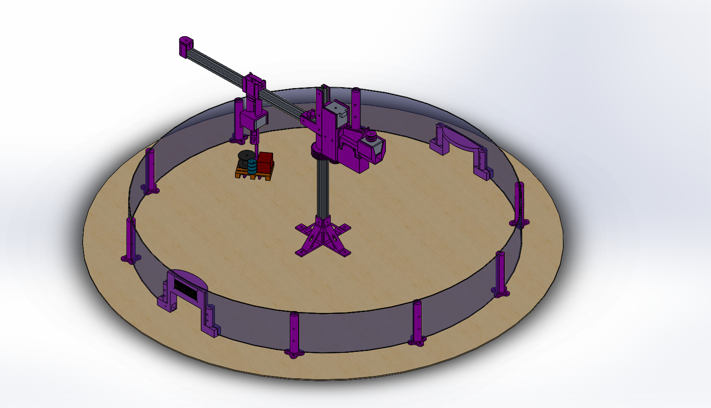
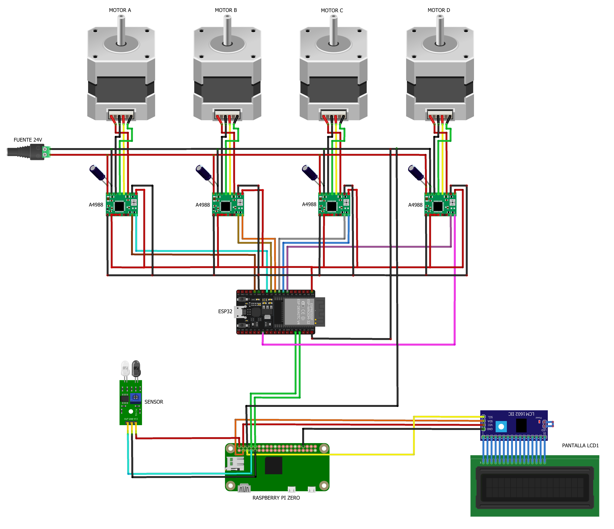
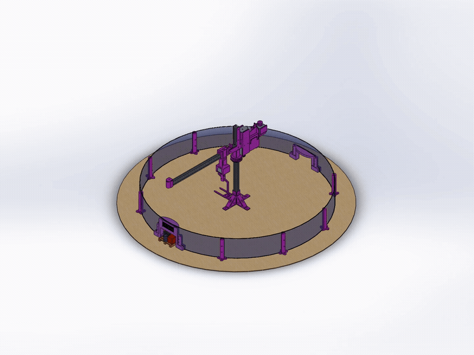
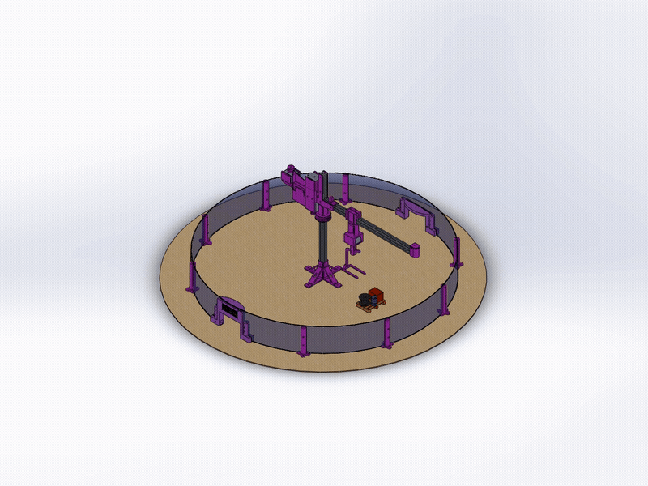
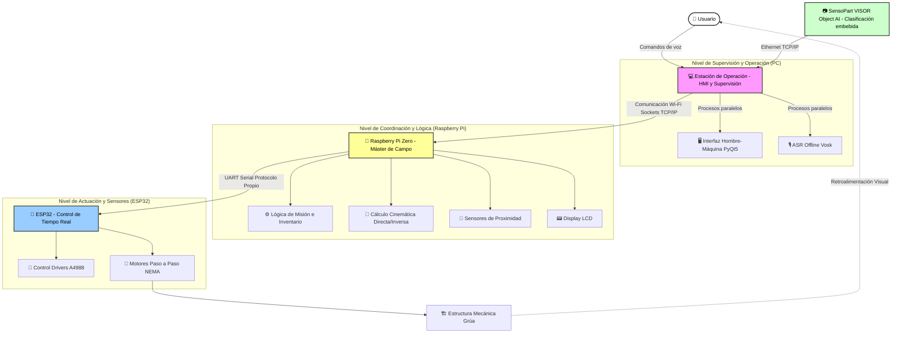
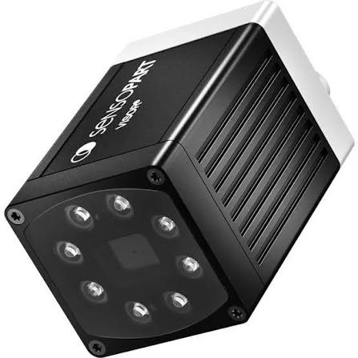

<div align="center">


<h2 align="center">Facultad de Ingeniería – Universidad Nacional de Lomas de Zamora</h2>

# 🏗️ Grúa Torre Robótica Inteligente

### Proyecto Final de Carrera | Ingeniería en Mecatrónica


</div>

---

> 📄 **[Leé primero el Brief](Doc/Brief.md)** — de qué se trata el proyecto y
> cuál es su finalidad, explicado sin contenido técnico.

---

## 📑 Índice

- [🧠 Descripción General](#-descripción-general)
- [📸 Galería y Demostraciones](#-galería-y-demostraciones)
- [🚀 Arquitectura del Sistema](#-arquitectura-del-sistema)
- [🔍 Decisiones de Ingeniería](#-decisiones-de-ingeniería)
- [💰 Costos del Proyecto](#-costos-del-proyecto)
- [🔌 Hardware y Esquema de Conexiones](#-hardware-y-esquema-de-conexiones)
- [📡 Protocolos de Comunicación](#-protocolos-de-comunicación)
- [📐 Cinemática y Control Embebido](#-cinemática-y-control-embebido)
- [⚙️ Funcionalidades Clave](#️-funcionalidades-clave)
- [🛠️ Tecnologías Utilizadas](#️-tecnologías-utilizadas)
- [📂 Estructura del Repositorio](#-estructura-del-repositorio)
- [🙏 Agradecimientos](#-agradecimientos)
- [👤 Autores](#-autores)

---

## 🧠 Descripción General

Este repositorio contiene el desarrollo integral (software, hardware, planos y documentación) de una **grúa torre robótica a escala**, presentada como Proyecto Final de Carrera para la carrera de **Ingeniería en Mecatrónica** en la Universidad Nacional de Lomas de Zamora (UNLZ).

El sistema simula un entorno logístico automatizado de alta complejidad. Integra hardware embebido, modelado cinemático tridimensional e Inteligencia Artificial distribuida para lograr un ciclo autónomo de:

1. **Percepción:** Detección y clasificación de objetos en tiempo real mediante visión artificial.
2. **Decisión:** Reconocimiento de comandos de voz e interpretación de órdenes, y gestión lógica de inventario.
3. **Actuación:** Movimiento coordinado de precisión para la manipulación, almacenamiento y entrega de cargas. El diseño mecánico contempla diferentes mecanismos de transmisión, empleando reducción por engranajes para el eje principal (Motor A) y transmisión por cable para el resto de los ejes de la estructura.

> **Evolución Tecnológica:** La arquitectura de control de bajo nivel fue optimizada utilizando un microcontrolador **ESP32** bajo un paradigma de programación estructurada y modular. Esto garantiza una ejecución determinista de tiempo real para el manejo simultáneo de 4 actuadores paso a paso con velocidades independientes.

---

## 📸 Galería y Demostraciones

El proyecto cuenta con un diseño de ingeniería respaldado por modelos CAD y esquemas electrónicos, disponibles en este repositorio.

<div align="center">
  
  <br>
  <em>Render del ensamblaje mecánico completo de la grúa torre.</em>
</div>

<br>

<div align="center">
  
  <br>
  <em>Esquemático del circuito de potencia y control (Integración de ESP32, Drivers L298N, Raspberry Pi, Sensor, Pantalla LCD).</em>
</div>

<br>

### ⚙️ Modos de Operación Activos

**1. Almacenamiento Automatizado (Visión Artificial)** El sistema detecta e identifica los objetos en el espacio de trabajo para almacenarlos de forma autónoma.

<div align="center">
  
</div>

<br>

**2. Despacho (Reconocimiento de Voz)** Mediante comandos de voz en lenguaje natural, la grúa busca el material solicitado en el inventario y lo despacha dinámicamente hacia la zona de descarga.

<div align="center">
  
</div>

<br>

> **🎬 Video Completo:** La simulación íntegra y en alta resolución de todo el proceso logístico está disponible en el repositorio. [Haz clic aquí para ver o descargar Animacion_Completa.mp4](Media/Animacion_Completa.mp4).

---

## 🚀 Arquitectura del Sistema

El proyecto implementa un modelo de computación distribuida y *Edge Computing*, segmentando las tareas críticas según la capacidad de cómputo:



### Flujo de Trabajo Operativo

1. **Supervisión y Percepción (Estación de Operación):** Aloja el HMI, opera el sensor de visión por disparo bajo demanda y ejecuta el reconocimiento del habla en procesos paralelos (*multiprocessing*). Traduce las intenciones del usuario y envía comandos lógicos a la estación de campo.
2. **Coordinación de Campo (Raspberry Pi):** Gestiona el inventario, interactúa con sensores y traduce las coordenadas espaciales cartesianas a coordenadas angulares y lineales.
3. **Actuación Dedicada (ESP32):** Recibe de forma secuencial las coordenadas parametrizadas y genera los trenes de pulsos precisos para los drivers de potencia de los motores A, B, C y D.

---

## 🔍 Decisiones de Ingeniería

### Subsistema de visión

La identificación de piezas se resolvía originalmente con un modelo propio
(TensorFlow Lite + OpenCV) ejecutado en la estación de operación sobre la
imagen de un teléfono celular. Fue reemplazado por un sensor de visión
industrial **SensoPart VISOR Object AI**, con clasificador embebido en el
propio dispositivo.

Ambas soluciones clasifican mediante aprendizaje automático: lo que cambió es
la plataforma de ejecución y la cadena de adquisición. Como la pieza se
deposita siempre en la misma posición y el subsistema solo determina de qué
pieza se trata, el margen de mejora no estaba en el modelo sino en la
repetibilidad de la imagen de entrada. El teléfono aplica ajustes automáticos
que no pueden desactivarse; el sensor industrial, con iluminación y óptica
fijas, elimina esa variabilidad en el origen en lugar de compensarla.

El sensor entrega la clase por Ethernet TCP/IP a la estación de operación —la
Raspberry Pi Zero no dispone de interfaz Ethernet—, que la traduce en una orden
de misión hacia campo.

📄 [`Doc/Justificacion-Subsistema-Vision.md`](Doc/Justificacion-Subsistema-Vision.md)

## 💰 Costos del Proyecto

Valores de reposición a precio de mercado actual. Conversión a razón de
**1.520 ARS/USD**. No se imputan la estación de operación (PC), el micrófono ni
la tarjeta microSD, por tratarse de equipamiento preexistente del equipo.

### Electrónica y Control

| Componente | Cant. | Unit. (ARS) | Subtotal (ARS) | Subtotal (USD) |
| :--- | :---: | ---: | ---: | ---: |
| Raspberry Pi Zero 2 W | 1 | 45.000 | 45.000 | 29,61 |
| Microcontrolador ESP32 DevKit | 1 | 12.000 | 12.000 | 7,89 |
| Driver de motor paso a paso A4988 | 4 | 3.705 | 14.820 | 9,75 |
| Regulador conmutado step-down LM2596 | 4 | 6.000 | 24.000 | 15,79 |
| Fuente switching 24 V – 15 A | 1 | 19.199 | 19.199 | 12,63 |
| Sensor infrarrojo de proximidad | 1 | 2.500 | 2.500 | 1,64 |
| Display LCD 16×2 con módulo I2C | 1 | 9.000 | 9.000 | 5,92 |
| Cableado, borneras y conexionado | — | — | 15.000 | 9,87 |
| **Subtotal** | | | **141.519** | **93,10** |

### Actuadores

| Componente | Cant. | Unit. (ARS) | Subtotal (ARS) | Subtotal (USD) |
| :--- | :---: | ---: | ---: | ---: |
| Motor paso a paso NEMA 17 (ejes A y B) | 2 | 22.000 | 44.000 | 28,95 |
| Motor paso a paso NEMA 17 pancake (ejes C y D) | 2 | 20.018 | 40.036 | 26,34 |
| **Subtotal** | | | **84.036** | **55,29** |

### Estructura y Mecánica

| Componente | Cant. | Unit. (ARS) | Subtotal (ARS) | Subtotal (USD) |
| :--- | :---: | ---: | ---: | ---: |
| Perfilería de aluminio 20×20 | — | — | 40.000 | 26,32 |
| Rodamiento axial | 1 | 16.000 | 16.000 | 10,53 |
| Hilo de nylon para transmisión por cable | — | — | 4.000 | 2,63 |
| Tornillería, insertos y elementos de fijación | — | — | 20.000 | 13,16 |
| **Subtotal** | | | **80.000** | **52,63** |

### Manufactura Aditiva

Los engranajes del eje principal, las poleas de transmisión, los soportes y las
piezas de carga del almacén fueron fabricados por impresión 3D. La primera etapa
de piezas se resolvió mediante servicio tercerizado; a partir de la segunda
iteración del diseño, la fabricación pasó a realizarse con equipamiento propio,
lo que permitió acortar sensiblemente el ciclo de rediseño y prueba.

| Concepto | Subtotal (ARS) | Subtotal (USD) |
| :--- | ---: | ---: |
| Servicio de impresión tercerizado (etapa inicial) | 65.000 | 42,76 |
| Impresión propia — filamento e insumos (etapa posterior) | 20.000 | 13,16 |
| **Subtotal** | **85.000** | **55,92** |

### Sistema de Visión

El sensor de visión industrial **SensoPart VISOR Object AI** fue cedido en
préstamo por eMove Solutions para el desarrollo del proyecto (ver
[Agradecimientos](#-agradecimientos)), por lo que no representa una erogación y
no se imputa al presupuesto.

### Resumen

| Concepto | ARS | USD |
| :--- | ---: | ---: |
| Electrónica y control | 141.519 | 93,10 |
| Actuadores | 84.036 | 55,29 |
| Estructura y mecánica | 80.000 | 52,63 |
| Manufactura aditiva | 85.000 | 55,92 |
| **Costo total del proyecto** | **390.555** | **256,94** |

*Equipamiento no imputado: estación de operación (PC), micrófono, tarjeta
microSD y sensor de visión (cedido en préstamo).*

## 🔌 Hardware y Esquema de Conexiones

Para asegurar la estabilidad del sistema y mitigar ruidos lógicos o caídas de tensión bruscas, todas las referencias de tierra (`GND` de la fuente de alimentación externa, placa de desarrollo ESP32, Raspberry Pi Zero, sensor óptico de proximidad y pantalla LCD) están interconectadas eléctricamente a una única masa común.

### Asignación de Pines - ESP32 (Etapa de Potencia y Drivers)

| Componente | Motor Asociado | Pin STEP | Pin DIR |
| :--- | :--- | :---: | :---: |
| **Driver A4988 (A)** | Brazo (Eje Principal) | GPIO 13 | GPIO 14 |
| **Driver A4988 (B)** | Carro (Traslación) | GPIO 27 | GPIO 26 |
| **Driver A4988 (C)** | Gancho (Subida/Bajada) | GPIO 25 | GPIO 33 |
| **Driver A4988 (D)** | Gancho (Rotación) | GPIO 32 | GPIO 4 |

### Asignación de Pines - Raspberry Pi Zero (Periféricos e Interfaces)

| Componente | VCC (Alimentación) | GND (Tierra) | Señales de Datos / Pines |
| :--- | :---: | :---: | :--- |
| **Sensor de Proximidad** | 5V | Masa Común | OUT ➔ Pin 7 (GPIO 4) |
| **Pantalla LCD (Módulo I2C)** | 5V | Masa Común | SDA ➔ Pin 3 (GPIO 2) <br> SCL ➔ Pin 5 (GPIO 3) |

---

## 📡 Protocolos de Comunicación
 
La transferencia de datos e instrucciones dentro de la arquitectura distribuida se organiza en tres niveles jerárquicos independientes:

1. **Sockets TCP/IP (Sensor de visión ↔ Estación de Operación):** Enlace Ethernet sobre el cual la estación envía el comando de disparo y recibe el telegrama con la clase identificada.
2. **Sockets TCP/IP (PC ↔ Raspberry Pi):** Comunicación inalámbrica bidireccional y asíncrona establecida a través de una red Wi-Fi local. Permite el envío seguro de comandos lógicos de misión y la actualización del estado de inventario en tiempo real.
3. **Protocolo Serial UART Custom (Raspberry Pi ↔ ESP32):** Conexión física directa cableada por hardware a través de los pines dedicados RX/TX. Para una correcta transferencia de tramas de datos sin pérdidas ni corrupción de bytes, las líneas de comunicación se conectan de manera estrictamente cruzada:
   * `PIN TX (Raspberry Pi Zero)` ➔ `PIN RX (ESP32)`
   * `PIN RX (Raspberry Pi Zero)` ➔ `PIN TX (ESP32)`
   
   *Soporte de datos:* El intérprete de comandos del firmware del ESP32 está desarrollado con soporte nativo para procesar valores decimales de alta precisión (por ejemplo, comandos de coordenadas como `A:90.45`), permitiendo un control de posición angular y lineal submilimétrico.

---

## 📐 Cinemática y Control Embebido

### Lógica Secuencial de Fases Independientes
El algoritmo de control embebido ejecuta los movimientos de los 4 actuadores paso a paso siguiendo una estricta máquina de estados con secuencias de fase independientes. Esto previene esfuerzos mecánicos innecesarios y colisiones en el entorno de almacenamiento:
* **Fase 1 (Posicionamiento de Coordenadas Espaciales):** Se calcula la cinemática y se ejecuta el movimiento en paralelo y simultáneo de los motores A (rotación de brazo), B (traslación de carro) y D (giro de gancho). El sistema bloquea cualquier otra acción hasta que estos tres actuadores hayan alcanzado su posición de destino de forma precisa.
* **Fase 2 (Manipulación y Elevación):** Una vez concluida y confirmada la Fase 1, el sistema habilita de forma aislada e independiente el movimiento del Motor C para controlar el descenso o ascenso del gancho de carga.

*Optimización Dinámica:* Con el objetivo de mejorar el rendimiento visual, la velocidad de respuesta en las demostraciones y garantizar una traslación directa, la lógica de control del firmware prescinde por completo del uso de rampas de aceleración y desaceleración en los trenes de pulsos de los motores paso a paso.

### Firmware Embebido Modular
El código fuente en C++ estructurado para el entorno del **ESP32** rompe con el esquema de script único y se organiza de forma modular y desacoplada:
* **Módulo Principal (`Main.ino`):** Administra el lazo de ejecución principal, la inicialización de periféricos y el parseo continuo del buffer del puerto serial.
* **Módulo de Configuración (`Config.cpp / .h`):** Centraliza de manera ordenada la asignación de GPIOs, constantes de paso, mapeos de hardware y variables globales.
* **Módulo de Control de Motores (`Motor.cpp / .h`):** Implementa la lógica orientada a objetos para la manipulación simultánea de los actuadores mediante la generación de pulsos (STEP) y dirección (DIR) con perfiles de velocidad inyectables en tiempo real.

---

## ⚙️ Funcionalidades Clave

- **Interfaz Hombre-Máquina (HMI):** Aplicación de escritorio desarrollada en
  PyQt5 que centraliza la operación y supervisión del sistema, organizada en
  tres pestañas:
  - *GLOBAL:* visualización en vivo de la imagen del sensor de visión y consola
    unificada de eventos, con diferenciación por color según el nodo de origen
    (estación de operación, estación de campo o interfaz).
  - *Control PC:* arranque y detención supervisada del proceso de percepción y
    comunicaciones que se ejecuta en la estación de operación.
  - *Raspberry / SSH:* establecimiento de sesión SSH interactiva con la estación
    de campo, puesta en marcha y detención remota de su software de control, y
    envío directo de comandos a la consola del dispositivo.

  Una barra de estado permanente informa la disponibilidad de los cinco
  elementos del sistema: estación de operación, sensor de visión, enlace de
  sockets, estación de campo y controlador de tiempo real.

- **Clasificación de Piezas por Visión Industrial:** Identificación de la pieza
  depositada en la estación de entrada mediante sensor **SensoPart VISOR
  Object AI**, con detector de clasificación por aprendizaje ejecutado de forma
  embebida en el propio dispositivo e iluminación integrada. El sensor opera por
  disparo bajo demanda: la estación de operación envía el comando de trigger y
  recibe la clase identificada como telegrama por Ethernet TCP/IP.

- **Disparo Automático del Ciclo de Almacenamiento:** El ciclo no lo inicia el
  operador sino un sensor infrarrojo instalado en la estación de entrada,
  gestionado por la estación de campo mediante detección por flanco con
  antirrebote y tiempo de inhibición, evitando disparos espurios y repetidos.

- **Reconocimiento Automático del Habla (ASR Offline):** Transcripción de
  comandos de voz en español ejecutada localmente mediante la API de Vosk, sin
  requerir conexión a internet. Incorpora palabra de activación, de modo que el
  sistema solo interpreta como orden la locución inmediatamente posterior a
  ella, reduciendo activaciones involuntarias por conversación ambiente.

- **Gestión de Inventario y Asignación de Posiciones:** Registro de ocupación
  del almacén mantenido por la estación de campo, con dos posiciones asignadas
  por tipo de pieza. El sistema resuelve automáticamente la posición libre de
  destino en el almacenamiento y la posición ocupada de origen en el despacho,
  y rechaza la orden informando por pantalla cuando no hay espacio disponible o
  cuando no existe la pieza solicitada.

- **Arquitectura de Ejecución Concurrente:** La estación de operación emplea
  procesos independientes (*multiprocessing*) para la interacción con el sensor
  de visión, el reconocimiento de voz y el despacho de mensajes, con
  comunicación entre ellos por colas. La estación de campo emplea hilos
  (*multithreading*) para la atención del socket, la escucha del controlador de
  tiempo real, el sensor de disparo, la supervisión de red y la ejecución de
  secuencias.

- **Supervisión de Enlace y Recuperación Automática:** La estación de campo
  verifica periódicamente la presencia de la estación de operación en la red y,
  ante la pérdida sostenida del enlace, reinicia automáticamente su interfaz
  inalámbrica. Los sockets implementan reconexión automática en ambos extremos.
---

## 🛠️ Tecnologías Utilizadas
| Capa del Proyecto               | Tecnologías y Herramientas                                                                      |
| ------------------------------- | ----------------------------------------------------------------------------------------------- |
| **Interfaz y Supervisión**      | Python 3.9+, PyQt5, QtWebEngine, Paramiko (SSH), Multiprocessing, QThread.                      |
| **Visión Artificial**           | SensoPart VISOR Object AI, SensoPart Configuration Studio, Telegramas sobre sockets TCP/IP.     |
| **Procesamiento de Voz**        | API Vosk (Modelo en Español), sounddevice, Palabra de activación e intérprete de comandos.      |
| **Procesamiento de Campo**      | Raspberry Pi OS, Python (threading, queue), Sockets TCP/IP, RPi.GPIO, RPLCD (I2C), Álgebra Matricial. |
| **Control en Tiempo Real**      | C++, Framework Arduino / ESP-IDF, UART 115200 bps, Protocolo de tramas propio, Arquitectura Modular. |
| **Hardware y Potencia**         | ESP32, Drivers A4988, Motores Paso a Paso NEMA, regulador step Down LM2596, Sensor IR, Display LCD 16×2 I2C.                |
| **Diseño e Ingeniería**         | SolidWorks (Modelado CAD 3D), Planos Técnicos, Parámetros DH.                                   |

---

---

## 📂 Estructura del Repositorio

```bash
.
├── 📂 Datasheets/     # Hojas de datos técnicas de componentes (ESP32, NEMA, A4988, sensores).
├── 📂 Diseños/        # Archivos CAD originales, piezas 3D y elementos para manufactura.
├── 📂 Doc/            # Documentación de Ingeniería: cálculos, memoria técnica y tesis del PFC.
├── 📂 Media/          # Recursos multimedia utilizados en la documentación.
├── 📂 Planos/         # Planos constructivos mecánicos con vistas normalizadas y diagramas eléctricos.
├── 📂 Scripts/        # Scripts de software secundarios para pruebas de UART, red y calibración de motores.
├── 📂 assets/         # Archivos utilizados en el documento principal de presentación
└── 📄 README.md       # Documento principal de presentación del repositorio.
```
---

## 🙏 Agradecimientos

El desarrollo de este proyecto contó con la colaboración de terceros cuyo aporte
excedió lo estrictamente material y permitió elevar el alcance técnico del
trabajo:

**eMove Solutions** — empresa en la que se desempeña profesionalmente uno de los
autores. Se agradece la cesión en préstamo del sensor de visión industrial
SensoPart VISOR Object AI, y el acceso facilitado a equipamiento y tecnologías de
aplicación industrial real. Esa disponibilidad permitió sustituir una solución de
prototipo por un componente de campo calificado y abordar el subsistema de visión
con criterios de ingeniería industrial, algo difícil de alcanzar en el marco de un
proyecto académico.

<div align="center">
  
  <br>
  <sub><i>Sensor de visión SensoPart VISOR Object AI</i></sub>
</div>

**IDEA3D Impresiones** — por la asistencia en la fabricación de las primeras
piezas del prototipo mediante impresión 3D, durante la etapa inicial de
desarrollo mecánico.

---

## 👤 Autores

Proyecto de fin de carrera desarrollado por los estudiantes de la Facultad de Ingeniería de la UNLZ:

<div align="center">

| **Valentín Coluccio** | **Franco Gómez** |
| :---: | :---: |
| <a href="https://github.com/ValentinColuccio"></a> | <a href="https://github.com/FrancoGomez-98"></a> |
| <a href="https://www.linkedin.com/in/valentin-coluccio-804301359/"></a> | <a href="https://www.linkedin.com/in/franco-gomez-0a71822a7/"></a> |

---

_Desarrollado con pasión, curiosidad y muchas pruebas y errores 🚀_

</div>
